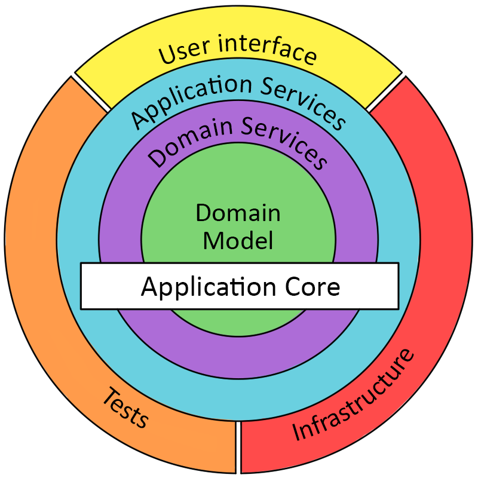

Simple .NET Core REST API with CQRS and DDD implementation, applied some of the Clean Code Practices.
==============================================================
If you learn something or intent to use as an application, please give it a star. Thanks!

## Description
Backend service for a system that allows you to create account, upload images and comment on them. 

## Code Design 

[Domain Driven Design](https://docs.microsoft.com/en-us/dotnet/architecture/microservices/microservice-ddd-cqrs-patterns/ddd-oriented-microservice).
[Basic CQRS](https://docs.microsoft.com/en-us/azure/architecture/guide/architecture-styles/cqrs) 

## Implementation
[.NET Core 3.1 Web Api](https://docs.microsoft.com/en-us/aspnet/core/tutorials/first-web-api?view=aspnetcore-5.0&tabs=visual-studio)
[MediatR](https://github.com/jbogard/MediatR) for domain event notifications and to reduce tight coupling.
[FluentValidation](https://github.com/JeremySkinner/FluentValidation) to validate requests.
[Entity Framework Core](https://github.com/dotnet/efcore) with in memory data source in development mode.
[Swagger](https://github.com/swagger-api) for API documentation.
[Blob Triggered Azure Function](https://docs.microsoft.com/en-us/azure/azure-functions/functions-bindings-storage-blob-trigger?tabs=csharp) to unify images as jpg format.

## How to run application

##### Using Azure Cloud:
1. Publish Web.API to Azure App Service.
2. Set connection string in appsettings.json/or in AppSercice configuration to use a persistent storage.
   Or leave it empty to use in-memory database.(Data will be released when host is down.)
3. Set blob storage connection string to use Azure blob storage to store images.
4. Use swagger or Postman to call the Web.API endpoints.
5. Publish ImageConverter function app to Azure, to enable asynchronious image convert operation (JPG).

##### Using Local Environment:
1. Pusblish Web.API to local IIS or run in Visual Studio in local environment
2. Set connection string in appsettings.json to use a persistent storage.
   Or leave it empty to use in-memory database.(Data will be released when host is down.)
3. Set blob storage connection string to use Azure blob storage for images.
   Or leave it empty to use local server storage.
4. Run Web.API in Visual Studio and swagger link will be opened by default. Use swagger or Postman to call the endpoints.
5. If you choose Azure Blob Storage, then run ImageConverter function locally or on Azure to enable asynchronious image convert operation.
   If no Azure Storage Connection is specified, then images will be uploaded to web root and will be automatically converted to jpg format.
